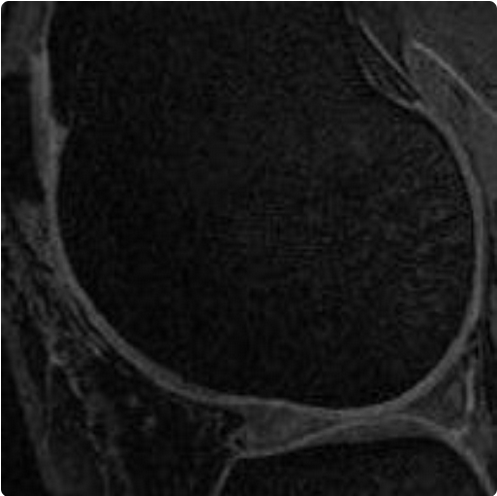
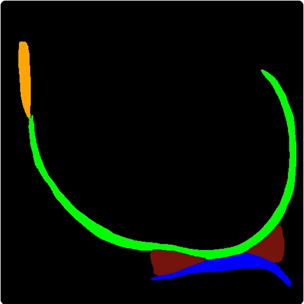
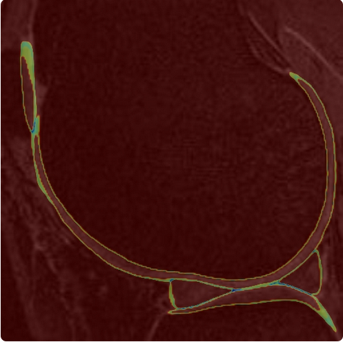

# 🦿 KneeXNet-2.5D

**An AI Toolset for Knee Cartilage and Meniscus Segmentation in MRIs**

This project is a **Streamlit-based web app** that performs cartilage and meniscus segmentation from knee MRI slices using an ensemble of pretrained **2.5D U-Net models**. It provides clear visualizations and entropy-based uncertainty overlays to help assess segmentation confidence.


---

## ✨ Features

* 📤 Upload `.npy` volumes of grayscale MRI slices
* 🤖 4 deep learning models (2 at 256×256, 2 at 512×512 resolution)
* 🔀 Model fusion for more robust predictions
* 🔎 Entropy-based uncertainty overlay
* 🧠 Color-coded segmentation visualization
* 📚 Anatomical structure legend
* ⚡ Fast, local execution using PyTorch and Streamlit

---

## 🧠 Model Details

Each model is a `2.5D U-Net` taking 3 adjacent grayscale slices as input (mimicking a 3-channel RGB input). Two models are trained at `256×256`, and two at `512×512`. Their outputs are:

* Softmax probabilities (per class)
* Averaged and fused
* Converted to segmentation map via `argmax`
* Processed into entropy maps for uncertainty visualization

---

## 🗂 Input Format

* A single `.npy` file
* Must be a 3D array of shape `[N_slices, H, W]`
* At least 3 slices required for valid prediction

---

## 📁 Segmentation Classes

| Label | Structure                 | Color Code   |
| ----- | ------------------------- | ------------ |
| 1     | Distal femoral cartilage  | 🟩 `#00FF00` |
| 2     | Proximal tibial cartilage | 🟦 `#3399FF` |
| 3     | Patellar cartilage        | 🟧 `#FFB300` |
| 4     | Meniscus                  | 🟫 `#5D1000` |
| 0     | Background                | ⚫ `#000000`  |

---

## 🚀 Getting Started

### 🔧 Requirements

* Python 3.9+
* PyTorch
* `segmentation_models_pytorch`
* OpenCV, PIL, Streamlit, torchvision, NumPy

Install dependencies:

```bash
pip install -r requirements.txt
```

> **Note**: You will also need the pretrained `.pth` model files in the `models/` directory.

### ▶️ Run the App

```bash
streamlit run app.py
```

or

```bash
make app
```

The app will launch in your browser at `http://localhost:8501`.

---

## 📸 Screenshots

| Grayscale Slice          | Segmentation Map     | Entropy Overlay              |
| ------------------------ | -------------------- | ---------------------------- |
|  |  |  |

---

## 🗃 Project Structure

```
.
├── app.py                   # Main Streamlit app
├── models/                  # Directory for trained models (not included in repo)
│   ├── 256_model_1.pth      # Contact maintainer for access
│   ├── 256_model_2.pth
│   ├── 512_model_1.pth
│   ├── 512_model_2.pth
│   └── localizer.pth
├── readme.md
└── requirements.txt
```

---

## 🧪 Development Notes

* Uses `@st.cache_resource` to optimize model loading
* Supports dynamic resizing of outputs
* Entropy is calculated using `-Σ p * log(p)` from fused softmax maps
* Visualization built using OpenCV, Streamlit, and numpy

---

## 📜 License

No License Yet.

---

## 🙏 Acknowledgements

* Pretrained U-Net models from [pitthexai](https://github.com/pitthexai)
* Streamlit for the UI framework
* University of Pittsburgh’s HEXAI Lab

